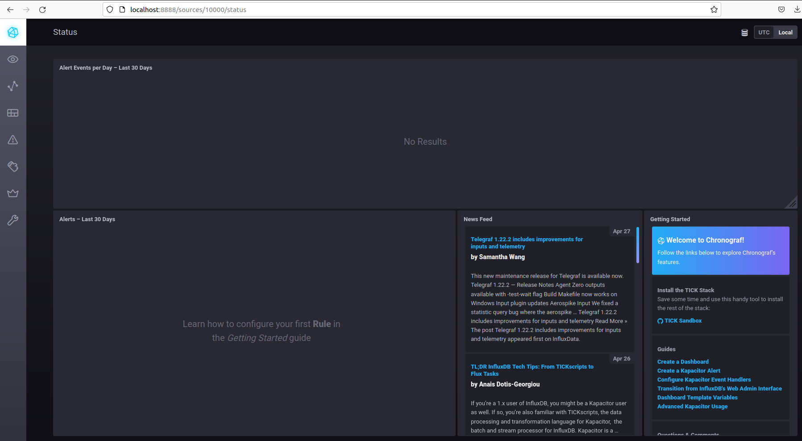
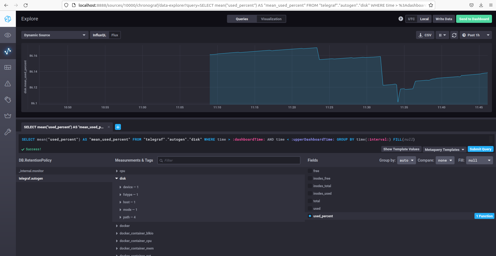
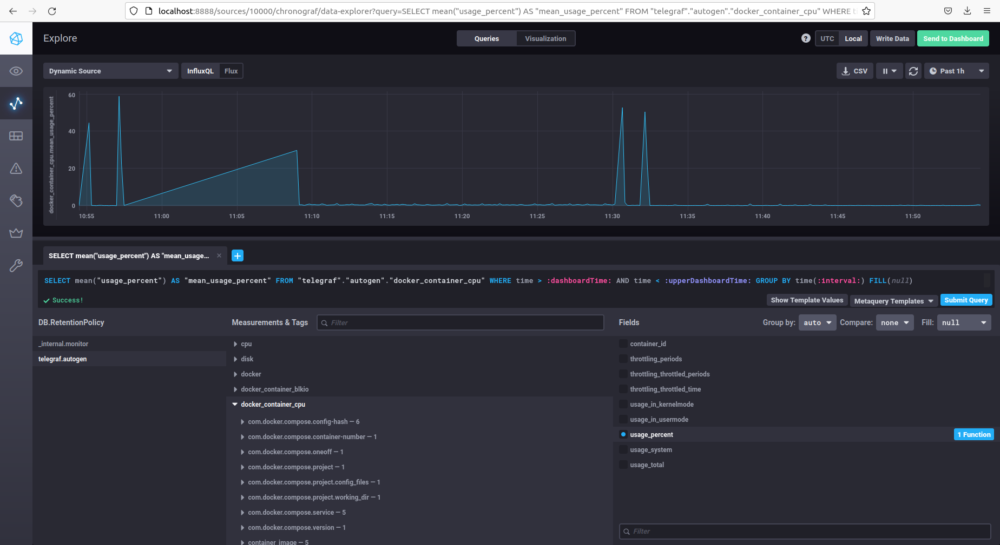

# Домашнее задание к занятию "10.02. Системы мониторинга"

## Обязательные задания

1. Опишите основные плюсы и минусы pull и push систем мониторинга.  
 ### + Push  
    Шаблонизация добавления хостов
    Возможность направлять данные с одного агента в несколько систем.
    Использование UPD, снижение накладных расходов

 ### - Push
    необходимость установки агентов мониторинга на контролируемые хосты
    необходимость регулирования потока данных ]
    наличие множество точек конфигурирования

 ### + Pull

    централизованное регулирование процесса опроса агентов
    возможность использования прокси 
    проще отладка

 ### - Pull
    единая точка отказа, если нет резервирования 
    возможно потребуется открытие дополнительных портов 


2. Какие из ниже перечисленных систем относятся к push модели, а какие к pull? А может есть гибридные?

    - Prometheus - pull и push через push gateway
    - TICK - push
    - Zabbix - гибридная
    - VictoriaMetrics - push
    - Nagios - pull

3. Склонируйте себе [репозиторий](https://github.com/influxdata/sandbox/tree/master) и запустите TICK-стэк, 
используя технологии docker и docker-compose.

В виде решения на это упражнение приведите выводы команд с вашего компьютера (виртуальной машины):

    - curl http://localhost:8086/ping
    - curl http://localhost:8888
    - curl http://localhost:9092/kapacitor/v1/ping

А также скриншот веб-интерфейса ПО chronograf (`http://localhost:8888`). 

P.S.: если при запуске некоторые контейнеры будут падать с ошибкой - проставьте им режим `Z`, например
`./data:/var/lib:Z`

```bash
khozyainov@rkhozyainov-T530-ubuntu:~$ curl -i http://localhost:8086/ping
HTTP/1.1 204 No Content
Content-Type: application/json
Request-Id: ed689826-c796-11ec-800b-0242ac120003
X-Influxdb-Build: OSS
X-Influxdb-Version: 1.8.10
X-Request-Id: ed689826-c796-11ec-800b-0242ac120003
Date: Fri, 29 Apr 2022 08:32:38 GMT

rkhozyainov@rkhozyainov-T530-ubuntu:~$ curl -i http://localhost:8888
HTTP/1.1 200 OK
Accept-Ranges: bytes
Cache-Control: public, max-age=3600
Content-Length: 336
Content-Security-Policy: script-src 'self'; object-src 'self'
Content-Type: text/html; charset=utf-8
Etag: "3362220244"
Last-Modified: Tue, 22 Mar 2022 20:02:44 GMT
Vary: Accept-Encoding
X-Chronograf-Version: 1.9.4
X-Content-Type-Options: nosniff
X-Frame-Options: SAMEORIGIN
X-Xss-Protection: 1; mode=block
Date: Fri, 29 Apr 2022 08:32:43 GMT

<!DOCTYPE html><html><head><meta http-equiv="Content-type" content="text/html; charset=utf-8"><title>Chronograf</title><link rel="icon shortcut" href="/favicon.fa749080.ico"><link rel="stylesheet" href="/src.9cea3e4e.css"></head><body> <div id="react-root" data-basepath=""></div> <script src="/src.a969287c.js"></script> </body></html>rkhozyainov@rkhozyainov-T530-ubuntu:~$ 
rkhozyainov@rkhozyainov-T530-ubuntu:~$ curl -i http://localhost:9092/kapacitor/v1/ping
HTTP/1.1 204 No Content
Content-Type: application/json; charset=utf-8
Request-Id: fc8eb733-c796-11ec-800c-000000000000
X-Kapacitor-Version: 1.6.4
Date: Fri, 29 Apr 2022 08:33:03 GMT

```
<p align="center">
  
</p>


4. Перейдите в веб-интерфейс Chronograf (`http://localhost:8888`) и откройте вкладку `Data explorer`.

    - Нажмите на кнопку `Add a query`
    - Изучите вывод интерфейса и выберите БД `telegraf.autogen`
    - В `measurments` выберите mem->host->telegraf_container_id , а в `fields` выберите used_percent. 
    Внизу появится график утилизации оперативной памяти в контейнере telegraf.
    - Вверху вы можете увидеть запрос, аналогичный SQL-синтаксису. 
    Поэкспериментируйте с запросом, попробуйте изменить группировку и интервал наблюдений.

Для выполнения задания приведите скриншот с отображением метрик утилизации места на диске 
(disk->host->telegraf_container_id) из веб-интерфейса.

### Ответ  

Необходимо добавить plugin disk в конфигурацию telegraf 

telegraf.conf

```
[[inputs.disk]]
  ignore_fs = ["tmpfs", "devtmpfs", "devfs", "iso9660", "overlay", "aufs", "squashfs"]
```

<p align="center">
  
</p>


5. Изучите список [telegraf inputs](https://github.com/influxdata/telegraf/tree/master/plugins/inputs). 
Добавьте в конфигурацию telegraf следующий плагин - [docker](https://github.com/influxdata/telegraf/tree/master/plugins/inputs/docker):
```
[[inputs.docker]]
  endpoint = "unix:///var/run/docker.sock"
```

Дополнительно вам может потребоваться донастройка контейнера telegraf в `docker-compose.yml` дополнительного volume и 
режима privileged:
```
  telegraf:
    image: telegraf:1.4.0
    privileged: true
    volumes:
      - ./etc/telegraf.conf:/etc/telegraf/telegraf.conf:Z
      - /var/run/docker.sock:/var/run/docker.sock:Z
    links:
      - influxdb
    ports:
      - "8092:8092/udp"
      - "8094:8094"
      - "8125:8125/udp"
```

После настройке перезапустите telegraf, обновите веб интерфейс и приведите скриншотом список `measurments` в 
веб-интерфейсе базы telegraf.autogen . Там должны появиться метрики, связанные с docker.

Факультативно можете изучить какие метрики собирает telegraf после выполнения данного задания.

### Ответ

Docker plugin  уже включен в конфиге в репозитории 

```
[[inputs.docker]]
  endpoint = "unix:///var/run/docker.sock"
  container_names = []
  timeout = "5s"
  perdevice = true
  total = false
```
Необходимо добавить в docker-compose.yml в запуск контейнера telegraf 

```
user: telegraf:998
```
где 998 группа Docker

<p align="center">
  
</p>


## Дополнительное задание (со звездочкой*) - необязательно к выполнению

В веб-интерфейсе откройте вкладку `Dashboards`. Попробуйте создать свой dashboard с отображением:

    - утилизации ЦПУ
    - количества использованного RAM
    - утилизации пространства на дисках
    - количество поднятых контейнеров
    - аптайм
    - ...
    - фантазируйте)
    
    ---

### Как оформить ДЗ?

Выполненное домашнее задание пришлите ссылкой на .md-файл в вашем репозитории.

---

