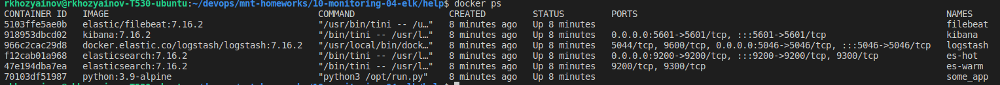
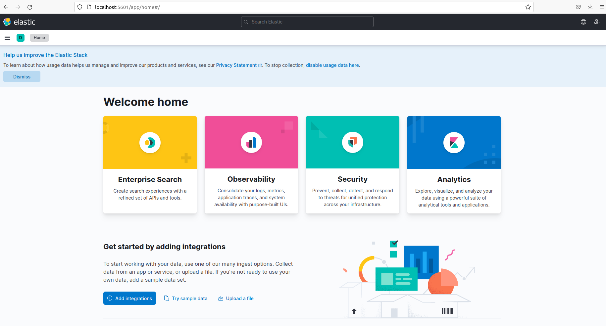
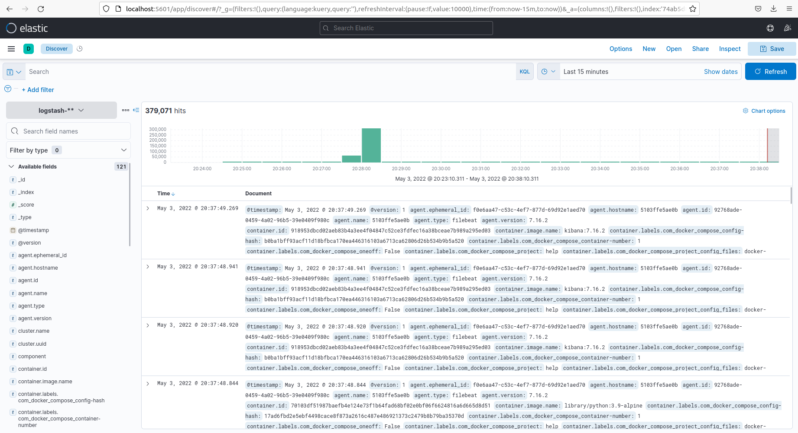

# Домашнее задание к занятию "10.04. ELK"

## Дополнительные ссылки

При выполнении задания пользуйтесь вспомогательными ресурсами:

- [поднимаем elk в докер](https://www.elastic.co/guide/en/elastic-stack-get-started/current/get-started-docker.html)
- [поднимаем elk в докер с filebeat и докер логами](https://www.sarulabs.com/post/5/2019-08-12/sending-docker-logs-to-elasticsearch-and-kibana-with-filebeat.html)
- [конфигурируем logstash](https://www.elastic.co/guide/en/logstash/current/configuration.html)
- [плагины filter для logstash](https://www.elastic.co/guide/en/logstash/current/filter-plugins.html)
- [конфигурируем filebeat](https://www.elastic.co/guide/en/beats/libbeat/5.3/config-file-format.html)
- [привязываем индексы из elastic в kibana](https://www.elastic.co/guide/en/kibana/current/index-patterns.html)
- [как просматривать логи в kibana](https://www.elastic.co/guide/en/kibana/current/discover.html)
- [решение ошибки increase vm.max_map_count elasticsearch](https://stackoverflow.com/questions/42889241/how-to-increase-vm-max-map-count)

В процессе выполнения задания могут возникнуть также не указанные тут проблемы в зависимости от системы.

Используйте output stdout filebeat/kibana и api elasticsearch для изучения корня проблемы и ее устранения.

## Задание повышенной сложности

Не используйте директорию [help](./help) при выполнении домашнего задания.

## Задание 1

Вам необходимо поднять в докере:
- elasticsearch(hot и warm ноды)
- logstash
- kibana
- filebeat

и связать их между собой.

Logstash следует сконфигурировать для приёма по tcp json сообщений.

Filebeat следует сконфигурировать для отправки логов docker вашей системы в logstash.

В директории [help](./help) находится манифест docker-compose и конфигурации filebeat/logstash для быстрого 
выполнения данного задания.

Результатом выполнения данного задания должны быть:
- скриншот `docker ps` через 5 минут после старта всех контейнеров (их должно быть 5)
- скриншот интерфейса kibana
- docker-compose манифест (если вы не использовали директорию help)
- ваши yml конфигурации для стека (если вы не использовали директорию help)

### Ответ



## Задание 2

Перейдите в меню [создания index-patterns  в kibana](http://localhost:5601/app/management/kibana/indexPatterns/create)
и создайте несколько index-patterns из имеющихся.

Перейдите в меню просмотра логов в kibana (Discover) и самостоятельно изучите как отображаются логи и как производить 
поиск по логам.

В манифесте директории help также приведенно dummy приложение, которое генерирует рандомные события в stdout контейнера.
Данные логи должны порождать индекс logstash-* в elasticsearch. Если данного индекса нет - воспользуйтесь советами 
и источниками из раздела "Дополнительные ссылки" данного ДЗ.

### Ответ



#### Изменения в help  

в docker-compose.yml в filebeat добавлен параметр command: ["--strict.perms=false"] из за проблем с доступом к файлу filebeat.yml и добавлена сеть  
в logstash в разделе input изменен плагин с tcp на beats и в разделе output изменен index на  index => "logstash-%{+YYYY.MM.dd}"  

docker-compose.yml
```yml
# Max virtual memory areas vm.max_map_count must be least 262144
# sysctl -w vm.max_map_count=262144

version: '2.2'
services:

  es-hot:
    image: elasticsearch:7.16.2
    container_name: es-hot
    environment:
      - node.name=es-hot
      - cluster.name=es-docker-cluster
      - discovery.seed_hosts=es-warm
      - cluster.initial_master_nodes=es-hot,es-warm
      - bootstrap.memory_lock=true
      - "ES_JAVA_OPTS=-Xms512m -Xmx512m"
    volumes:
      - data01:/usr/share/elasticsearch/data:Z
    ulimits:
      memlock:
        soft: -1
        hard: -1
      nofile:
        soft: 65536
        hard: 65536
    ports:
      - 9200:9200
    networks:
      - elastic
    depends_on:
      - es-warm

  es-warm:
    image: elasticsearch:7.16.2
    container_name: es-warm
    environment:
      - node.name=es-warm
      - cluster.name=es-docker-cluster
      - discovery.seed_hosts=es-hot
      - cluster.initial_master_nodes=es-hot,es-warm
      - bootstrap.memory_lock=true
      - "ES_JAVA_OPTS=-Xms512m -Xmx512m"
    volumes:
      - data02:/usr/share/elasticsearch/data:Z
    ulimits:
      memlock:
        soft: -1
        hard: -1
      nofile:
        soft: 65536
        hard: 65536
    networks:
      - elastic

  kibana:
    image: kibana:7.16.2
    container_name: kibana
    ports:
      - 5601:5601
    environment:
      ELASTICSEARCH_URL: http://es-hot:9200
      ELASTICSEARCH_HOSTS: '["http://es-hot:9200","http://es-warm:9200"]'
    networks:
      - elastic
    depends_on:
      - es-hot
      - es-warm

  logstash:
    image: "docker.elastic.co/logstash/logstash:7.16.2"
    container_name: logstash
    ports:
      - 5046:5046
    volumes:
      - ./configs/logstash.conf:/usr/share/logstash/pipeline/logstash.conf:Z
      - ./configs/logstash.yml:/usr/share/logstash/config/logstash.yml:Z
    networks:
      - elastic
    depends_on:
      - es-hot
      - es-warm

  filebeat:
    image: elastic/filebeat:7.16.2
    container_name: filebeat
    privileged: true
    user: root
    command: ["--strict.perms=false"]
    volumes:
      - ./configs/filebeat.yml:/usr/share/filebeat/filebeat.yml:Z
      - /var/lib/docker:/var/lib/docker:Z
      - /var/run/docker.sock:/var/run/docker.sock:Z
      
    networks:
      - elastic
    depends_on:
      - logstash

  some_application:
    image: library/python:3.9-alpine
    container_name: some_app
    volumes:
      - ./pinger/run.py:/opt/run.py:Z
    entrypoint: python3 /opt/run.py

volumes:
  data01:
    driver: local
  data02:
    driver: local
  data03:
    driver: local

networks:
  elastic:
    driver: bridge

```

filebeat.yml
```yml
filebeat.inputs:
  - type: container
    # enabled: true
    paths:
      - '/var/lib/docker/containers/*/*.log'

processors:
  - add_docker_metadata:
      host: "unix:///var/run/docker.sock"

  - decode_json_fields:
      fields: ["message"]
      target: "json"
      overwrite_keys: true

output.logstash:
  hosts: ["logstash:5046"]


logging.json: true
logging.metrics.enabled: false

```

logstash.conf
```
input {
  beats {
    port => 5046
    codec => json
  }
}

filter {
  json {
     source => "message"
  }
}

output {
  elasticsearch { 
    hosts => ["es-hot:9200"] 
    index => "logstash-%{+YYYY.MM.dd}"
  }
  stdout { codec => rubydebug }
}

```

---

### Как оформить ДЗ?

Выполненное домашнее задание пришлите ссылкой на .md-файл в вашем репозитории.

---

 
